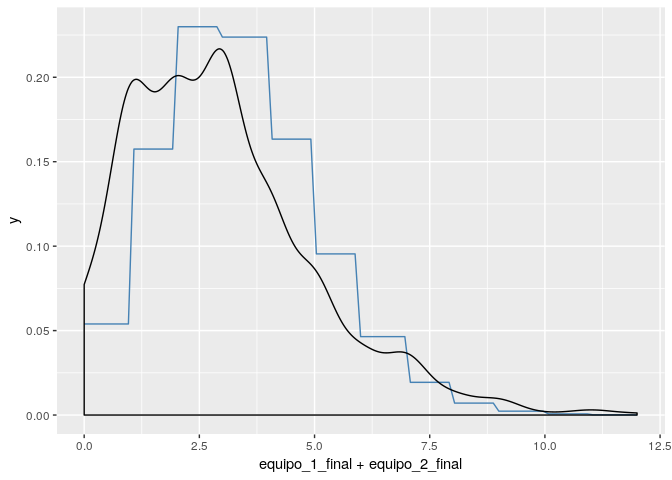
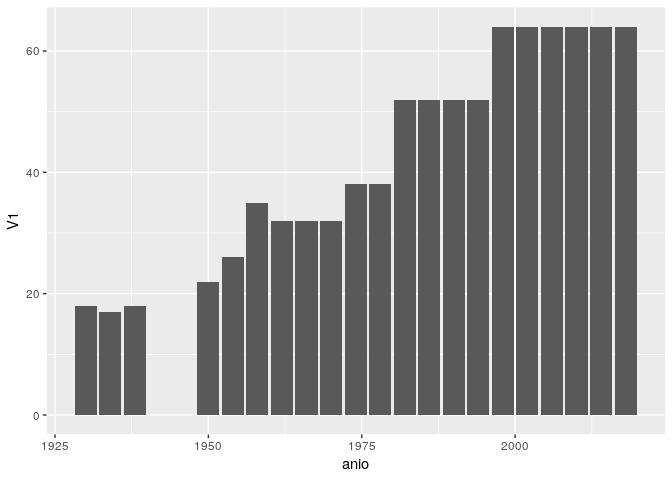
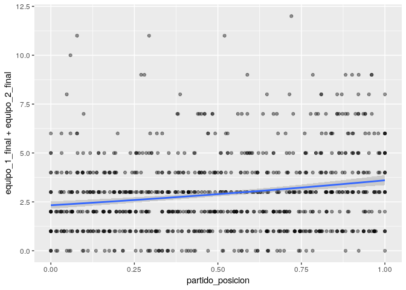
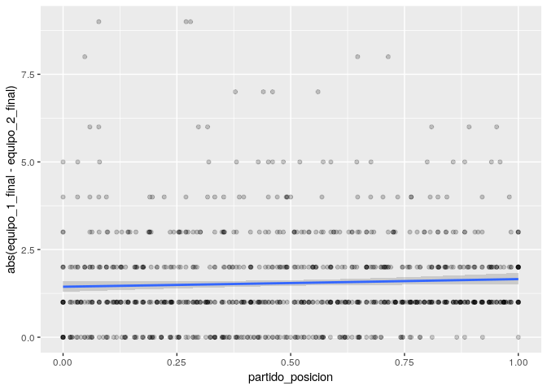
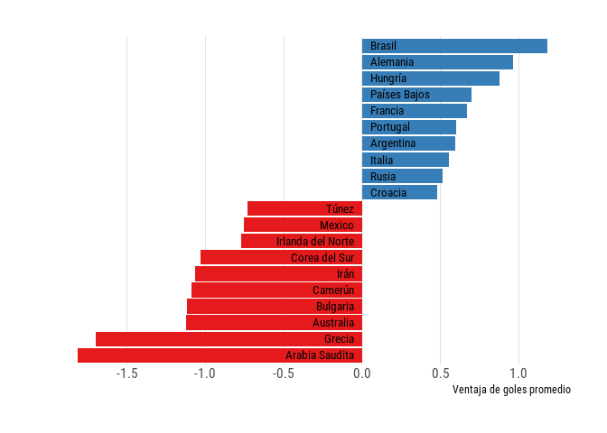

Copas del Mundo de Fútbol
================
Elio Campitelli

Lo primero es leer los datos y cargar librerías. Voy a leer sólo los procesados, por ahora:

``` r
library(data.table)
library(magrittr)
library(ggplot2)

mundiales <- fread("https://raw.githubusercontent.com/cienciadedatos/datos-de-miercoles/master/datos/2019/2019-04-10/partidos.txt")
```

Veamos qué tenemos...

``` r
str(mundiales)
```

    ## Classes 'data.table' and 'data.frame':   900 obs. of  10 variables:
    ##  $ anio          : int  1930 1930 1930 1930 1930 1930 1930 1930 1930 1930 ...
    ##  $ anfitrion     : chr  "Uruguay" "Uruguay" "Uruguay" "Uruguay" ...
    ##  $ estadio       : chr  "Estadio Pocitos" "Estadio Parque Central" "Estadio Parque Central" "Estadio Pocitos" ...
    ##  $ ciudad        : chr  "Montevideo" "Montevideo" "Montevideo" "Montevideo" ...
    ##  $ partido_orden : chr  "(1)" "(2)" "(3)" "(4)" ...
    ##  $ fecha         : chr  "1930-07-13" "1930-07-13" "1930-07-14" "1930-07-14" ...
    ##  $ equipo_1      : chr  "Francia" "Estados Unidos" "Yugoslavia" "Rumania" ...
    ##  $ equipo_2      : chr  "Mexico" "Bélgica" "Brasil" "Perú" ...
    ##  $ equipo_1_final: int  4 3 2 3 1 3 4 3 1 1 ...
    ##  $ equipo_2_final: int  1 0 1 1 0 0 0 0 0 0 ...
    ##  - attr(*, ".internal.selfref")=<externalptr>

Ok. Son resultados de cada partido de cada mundial entre 1930 y 2018. ¿Por qué la columna `partido_orden` es un caracter tan feito? Lo voy a transformar en numérico. También voy a transformar `fecha` en Date.

``` r
limpiar_orden <- function(x) {
  gsub("\\(", "", x) %>%     # Le saco el primer paréntesis
    gsub("\\)", "", .) %>%   # Le saco el segundo paréntesis
    as.numeric()             # Lo convierto en numérico
}

mundiales[, partido_orden := limpiar_orden(partido_orden)]
mundiales[, fecha := lubridate::ymd(fecha)]
```

Me interesó eso de tener el órden del partido en el mundial. ¿Habrá algún cambio entre los primeros partidos y los últimos? Por ejemplo, ¿se hacen más goles?

Primero, ¿cuántos goles hay en promedo? ¿Qué distribución tienen?

``` r
goles <- mundiales[, .(promedio = mean(equipo_1_final + equipo_2_final),
                       varianza = sd(equipo_1_final + equipo_2_final))]
knitr::kable(goles)
```

|  promedio|  varianza|
|---------:|---------:|
|      2.92|  2.015579|

``` r
ggplot(mundiales, aes(equipo_1_final + equipo_2_final)) +
  stat_function(fun = function(x) dpois(as.integer(x), goles$promedio), 
                color = "steelblue") +
  geom_density() 
```



Bueno, digamos que es bastante parecido a una distribución Poisson 🐟. Para ponerle un cacho más de rigurosidad podría hacer un test de Kolmogorov-Smirnov (🍸), por ahora lo dejamos a ojo.

Un problema es que no todos los mundiales tienen la misma cantidad de partidos. De hecho, la cantidad de partidos fue creciendo con el tiempo. Supongo que a medida que clasificaban más países (¿se nota que no sé cómo funciona el fútbol?)

``` r
mundiales[, max(partido_orden), by = anio] %>% 
  ggplot(aes(anio, V1)) +
  geom_col()
```



Entonces voy a normalizar el órden del partido de manera que el partido 0 va a ser el primerio y el 1, el último.

``` r
mundiales[, partido_posicion := (partido_orden - 1)/max(partido_orden - 1), 
          by = anio]

ggplot(mundiales, aes(partido_posicion, equipo_1_final + equipo_2_final)) +
  geom_point(alpha = 0.4) +
  geom_smooth(method = "glm", method.args = list(family = poisson))
```



Hay una tendencia. Los partidos más cercanos a la final, tienen más goles. Podemos hacer el modelo lineal generaliado para formalizar el análisis.

``` r
mundiales %>% 
  .[, goles := equipo_1_final + equipo_2_final] %>% 
  glm(goles ~ partido_posicion, data = ., family = poisson) -> fit_goles

summary(fit_goles)
```

    ## 
    ## Call:
    ## glm(formula = goles ~ partido_posicion, family = poisson, data = .)
    ## 
    ## Deviance Residuals: 
    ##     Min       1Q   Median       3Q      Max  
    ## -2.6845  -1.0319  -0.2017   0.6466   4.0291  
    ## 
    ## Coefficients:
    ##                  Estimate Std. Error z value Pr(>|z|)    
    ## (Intercept)       0.84466    0.04067  20.767  < 2e-16 ***
    ## partido_posicion  0.43720    0.06633   6.591 4.37e-11 ***
    ## ---
    ## Signif. codes:  0 '***' 0.001 '**' 0.01 '*' 0.05 '.' 0.1 ' ' 1
    ## 
    ## (Dispersion parameter for poisson family taken to be 1)
    ## 
    ##     Null deviance: 1294.3  on 899  degrees of freedom
    ## Residual deviance: 1250.6  on 898  degrees of freedom
    ## AIC: 3658.1
    ## 
    ## Number of Fisher Scoring iterations: 5

Si bien el efecto parece ser significativo, su magnitud no es muy grande. Si interpreto bien estos coeficientes, el partido final tiene --en promedio-- 0.44 más goles que el primero.

¿Y qué pasa con la diferencia de goles?

``` r
ggplot(mundiales, aes(partido_posicion, abs(equipo_1_final - equipo_2_final))) +
  geom_point(alpha = 0.2) +
  geom_smooth(method = "glm", method.args = list(family = poisson))
```



(Me fijé que la diferencia se aproxima a una Poisson --aunque algo peor que la suma)

Tampoco hay mucho efecto. Pero sí es interesante ver esos partidos con tanta diferencia. Algunos partidos con mucha diferencia de goles son estos:

``` r
mundiales[, diferencia := abs(equipo_1_final - equipo_2_final)] %>% 
  .[order(-diferencia)] %>% 
  .[1:10] %>% 
  .[, partido := paste0(equipo_1, " - ", equipo_2)] %>% 
  .[, resultado := paste0(equipo_1_final, " - ", equipo_2_final)] %>% 
  .[, .(anio, anfitrion, partido, resultado)]   %>% 
  knitr::kable(col.names = c("Año", "Sede", "Partido", "Resultado"))
```

|   Año| Sede                  | Partido                    | Resultado |
|-----:|:----------------------|:---------------------------|:----------|
|  1954| Suiza                 | Hungría - Corea del Sur    | 9 - 0     |
|  1974| Alemania occidental   | Yugoslavia - Zaire         | 9 - 0     |
|  1982| España                | Hungría - El Salvador      | 10 - 1    |
|  1938| Francia               | Suecia - Cuba              | 8 - 0     |
|  1950| Brasil                | Uruguay - Bolivia          | 8 - 0     |
|  2002| Corea del sur y Japón | Alemania - Arabia Saudita  | 8 - 0     |
|  1954| Suiza                 | Uruguay - Escocia          | 7 - 0     |
|  1954| Suiza                 | Turquía - Corea del Sur    | 7 - 0     |
|  1974| Alemania occidental   | Haití - Polonia            | 0 - 7     |
|  2010| Sudáfrica             | Portugal - Corea del Norte | 7 - 0     |

Quiero ver qué paises tienen el mejor y peor récord de goles. Para eso primero voy a calcular el resultado "neto" para cada país y reordenar los datos.

``` r
# Este es un truquito intersante. Si querés usar el resultado de un pipe 
# para crear varias variables y hacer cosas complicadas, podés usar llaves ({})
# para capturar toda una expresión. 
# Es altamente posible que haya alguna manera mejor de conseguir los datos en 
# el formato que quiero...
paises <- mundiales[, .(equipo_1, equipo_2, equipo_1_final, equipo_2_final)] %>%
  .[, equipo_2_neto := equipo_2_final - equipo_1_final] %>% 
  .[, equipo_1_neto := - equipo_2_neto] %>% 
  .[, partido := 1:.N] %>% 
  {
    temp1 <- .[, .(partido, equipo_1, equipo_2)] %>% 
      melt(id.var = c("partido"), variable.name = "id_equipo", value.name = "pais") %>% 
      .[, id_equipo := as.numeric(factor(id_equipo))]
    
    temp2 <- .[, .(partido, equipo_1_neto, equipo_2_neto)] %>% 
      melt(id.var = c("partido"), variable.name = "id_equipo", value.name = "goles") %>% 
      .[, id_equipo := as.numeric(factor(id_equipo))]
    
    temp1[temp2, on = c("partido", "id_equipo")]
  } %>% 
  .[order(partido, id_equipo)]

paises
```

    ##       partido id_equipo           pais goles
    ##    1:       1         1        Francia     3
    ##    2:       1         2         Mexico    -3
    ##    3:       2         1 Estados Unidos     3
    ##    4:       2         2        Bélgica    -3
    ##    5:       3         1     Yugoslavia     1
    ##   ---                                       
    ## 1796:     898         2     Inglaterra    -1
    ## 1797:     899         1        Bélgica     2
    ## 1798:     899         2     Inglaterra    -2
    ## 1799:     900         1        Francia     2
    ## 1800:     900         2        Croacia    -2

Y con esto puedo calcular la suma total de goles metidos menos goles que le metieron a cada país en toda la historia de los mundiales. Como no todos los países estuvieron en todos los mundiales, probablemente sea inteligente calcular el promedio. Además, voy a filtar a paises que jugaron más de 10 partidos en total.

``` r
# Unamos las dos alemanias y digamos que la Unión Soviética 
# fue siempre Rusia. Perdón Machin Lenin. 
paises[pais == "Alemania occidental", pais := "Alemania"]
paises[pais == "Unión Soviética", pais := "Rusia"]

goles_netos <- paises[, .(goles_neto_promedio = mean(goles),
                          goles_neto_suma = sum(goles),
                          n = .N), by = pais] 
goles_netos <- goles_netos[n >= 10]
goles_netos[, ranking := frank(-goles_neto_promedio)]

rango_max <- max(goles_netos$ranking)

# Son una bocha, así que veamos los 10 mejores y los 10 peores
goles_netos[ranking %between% c(1, 10) |
            ranking %between% c(rango_max - 9, rango_max)] %>% 
  ggplot(aes(reorder(pais, -ranking), goles_neto_promedio)) +
  geom_col(aes(fill = factor(sign(goles_neto_promedio)))) +
  geom_text(aes(label = pais, hjust = -sign(goles_neto_promedio)/2 + 1/2,
                y = sign(goles_neto_promedio)*0.05),
            size = 3.5,
            family = "Roboto Condensed") +
  coord_flip() +
  scale_x_discrete("") +
  scale_y_continuous("Ventaja de goles promedio", 
                     breaks = metR::MakeBreaks(0.5)) +
  scale_fill_brewer(palette = "Set1", guide = "none")  +
  hrbrthemes::theme_ipsum_rc(grid = "X") +
  theme(axis.text.y = element_blank())
```



Ahí lo tienen. Brasil en promedio gana por más de un gol mientras que Arabia Saudita pierde por casi dos goles.
