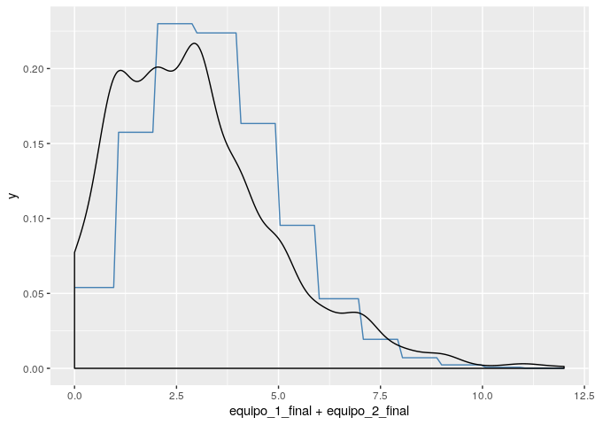
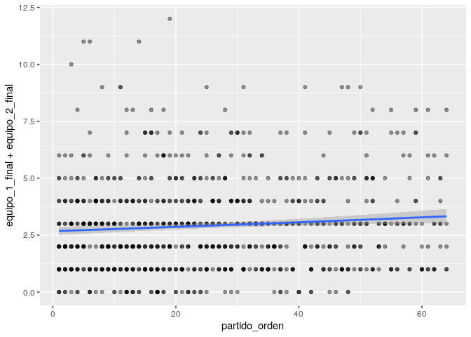
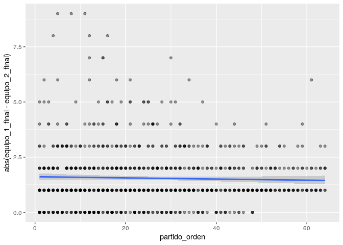

Copas del Mundo de Fútbol
================
Elio Campitelli

Lo primero es leer los datos y cargar librerías. Voy a leer sólo los
procesados, por ahora:

``` r
library(data.table)
library(magrittr)
library(ggplot2)

mundiales <- fread("https://raw.githubusercontent.com/cienciadedatos/datos-de-miercoles/master/datos/2019/2019-04-10/partidos.txt")
```

Veamos qué
    tenemos…

``` r
str(mundiales)
```

    ## Classes 'data.table' and 'data.frame':   900 obs. of  10 variables:
    ##  $ anio          : int  1930 1930 1930 1930 1930 1930 1930 1930 1930 1930 ...
    ##  $ anfitrion     : chr  "Uruguay" "Uruguay" "Uruguay" "Uruguay" ...
    ##  $ estadio       : chr  "Estadio Pocitos" "Estadio Parque Central" "Estadio Parque Central" "Estadio Pocitos" ...
    ##  $ ciudad        : chr  "Montevideo" "Montevideo" "Montevideo" "Montevideo" ...
    ##  $ partido_orden : chr  "(1)" "(2)" "(3)" "(4)" ...
    ##  $ fecha         : chr  "1930-07-13" "1930-07-13" "1930-07-14" "1930-07-14" ...
    ##  $ equipo_1      : chr  "Francia" "Estados Unidos" "Yugoslavia" "Rumania" ...
    ##  $ equipo_2      : chr  "Mexico" "Bélgica" "Brasil" "Perú" ...
    ##  $ equipo_1_final: int  4 3 2 3 1 3 4 3 1 1 ...
    ##  $ equipo_2_final: int  1 0 1 1 0 0 0 0 0 0 ...
    ##  - attr(*, ".internal.selfref")=<externalptr>

Ok. Son resultados de cada partido de cada mundial entre 1930 y 2018.
¿Por qué la columna `partido_orden` es un caracter tan feito? Lo voy a
transformar en numérico. También voy a transformar `fecha` en Date.

``` r
limpiar_orden <- function(x) {
  gsub("\\(", "", x) %>%     # Le saco el primer paréntesis
    gsub("\\)", "", .) %>%   # Le saco el segundo paréntesis
    as.numeric()             # Lo convierto en numérico
}

mundiales[, partido_orden := limpiar_orden(partido_orden)]
mundiales[, fecha := lubridate::ymd(fecha)]
```

Me interesó eso de tener el órden del partido en el mundial. ¿Habrá
algún cambio entre los primeros partidos y los últimos? Por ejemplo,
¿se hacen más goles?

Primero, ¿cuántos goles hay en promedo? ¿Qué distribución tienen?

``` r
goles <- mundiales[, .(promedio = mean(equipo_1_final + equipo_2_final),
              varianza = sd(equipo_1_final + equipo_2_final))]
knitr::kable(goles)
```

| promedio | varianza |
| -------: | -------: |
|     2.92 | 2.015579 |

``` r
ggplot(mundiales, aes(equipo_1_final + equipo_2_final)) +
  stat_function(fun = function(x) dpois(as.integer(x), goles$promedio), 
                color = "steelblue") +
  geom_density() 
```

<!-- -->

Bueno, digamos que es bastante parecido a una distribución Poisson 🐟.
Para ponerle un cacho más de rigurosidad podría hacer un test de
Kolmogorov-Smirnov (🍸), por ahora lo dejamos a ojo.

``` r
ggplot(mundiales, aes(partido_orden, equipo_1_final + equipo_2_final)) +
  geom_point(alpha = 0.4) +
  geom_smooth(method = "glm", method.args = list(family = poisson))
```

<!-- -->

Parece haber una *ligera* tendencia. Pero es mínima:

``` r
copy(mundiales) %>% 
  .[, goles := equipo_1_final + equipo_2_final] %>% 
  glm(goles ~ partido_orden, data = ., family = poisson) -> fit_goles

summary(fit_goles)
```

    ## 
    ## Call:
    ## glm(formula = goles ~ partido_orden, family = poisson, data = .)
    ## 
    ## Deviance Residuals: 
    ##     Min       1Q   Median       3Q      Max  
    ## -2.5098  -1.2007  -0.0790   0.6291   4.0228  
    ## 
    ## Coefficients:
    ##               Estimate Std. Error z value Pr(>|z|)    
    ## (Intercept)   0.983543   0.035807  27.468  < 2e-16 ***
    ## partido_orden 0.003411   0.001142   2.988  0.00281 ** 
    ## ---
    ## Signif. codes:  0 '***' 0.001 '**' 0.01 '*' 0.05 '.' 0.1 ' ' 1
    ## 
    ## (Dispersion parameter for poisson family taken to be 1)
    ## 
    ##     Null deviance: 1294.3  on 899  degrees of freedom
    ## Residual deviance: 1285.4  on 898  degrees of freedom
    ## AIC: 3693
    ## 
    ## Number of Fisher Scoring iterations: 5

Los goles se incrementan en 0.003 por partido jugado. Insignificante.

¿Y qué pasa con la diferencia de
goles?

``` r
ggplot(mundiales, aes(partido_orden, abs(equipo_1_final - equipo_2_final))) +
  geom_point(alpha = 0.4) +
  geom_smooth(method = "glm", method.args = list(family = poisson))
```

<!-- -->

(Me fijé que la diferencia se aproxima a una Poisson –aunque algo peor
que la suma)

Si bien no hay una tendencia en la media, se ve que sí pasa algo con la
variabilidad. En los primeros partidos hay más casos de goldeadas. Si
definimos “goleada” como una diferencia de goles mayor o igual a 3 y
agrupamos el orden de partidos de a 10 vemos este efecto.

``` r
copy(mundiales) %>% 
  .[, goleada := abs(equipo_1_final - equipo_2_final) >= 3] %>% 
  .[, .(goleada_frec = mean(goleada)), 
    by = .(partido_orden = round(partido_orden, -1))] %>% 
  ggplot(aes(partido_orden, goleada_frec)) +
  geom_line()
```

<!-- -->
