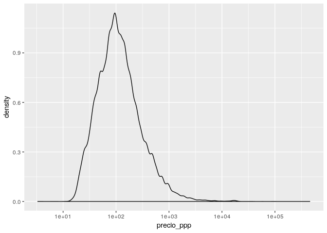
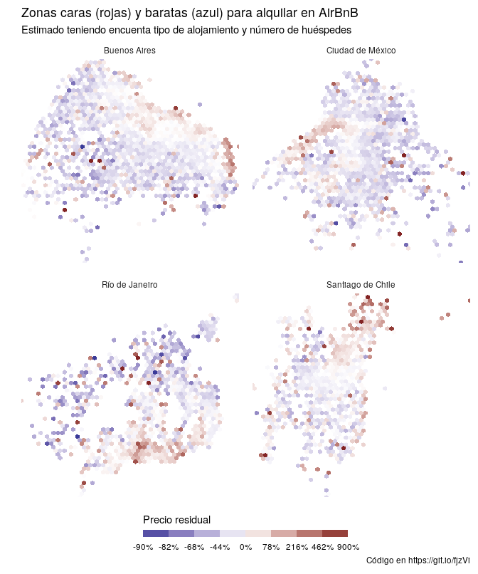

Copas del Mundo de Fútbol
================
Elio Campitelli

Voy a leer todos los datos y ponerlos en una sola tabla:

``` r
library(data.table)
library(ggplot2)
```

    ## Registered S3 methods overwritten by 'ggplot2':
    ##   method         from 
    ##   [.quosures     rlang
    ##   c.quosures     rlang
    ##   print.quosures rlang

``` r
library(magrittr)

buenos_aires <- fread("https://raw.githubusercontent.com/cienciadedatos/datos-de-miercoles/master/datos/2019/2019-06-05/buenos_aires.csv")
cdmx <- fread("https://raw.githubusercontent.com/cienciadedatos/datos-de-miercoles/master/datos/2019/2019-06-05/cdmx.csv")
rio <- fread("https://raw.githubusercontent.com/cienciadedatos/datos-de-miercoles/master/datos/2019/2019-06-05/rio.csv")
santiago <- fread("https://raw.githubusercontent.com/cienciadedatos/datos-de-miercoles/master/datos/2019/2019-06-05/santiago.csv")

airbnb <- rbindlist(
  list(ba = buenos_aires, 
       cdmx = cdmx, 
       rio = rio, 
       santiago = santiago),
  idcol = "ciudad" )
```

¿Qué es lo que
    tenemos?

``` r
str(airbnb)
```

    ## Classes 'data.table' and 'data.frame':   88465 obs. of  14 variables:
    ##  $ ciudad              : chr  "ba" "ba" "ba" "ba" ...
    ##  $ id                  : int  7270 11508 12463 13095 13096 13097 13099 13100 14222 14711 ...
    ##  $ descripcion         : chr  "¡¡Great Loft in Palermo Hollywood!!" "Amazing Luxurious Apt-Palermo Soho" "Room in Recoleta - awesome location" "Standard Room at Palermo Viejo B&B" ...
    ##  $ id_anfitrion        : int  18822 42762 48799 50994 50994 50994 50994 50994 55825 57770 ...
    ##  $ nombre_anfitrion    : chr  "Toni" "Candela" "Matt" "Ariel" ...
    ##  $ anfitrion_desde     : chr  "2009-05-26" "2009-10-01" "2009-10-28" "2009-11-03" ...
    ##  $ superanfitrion      : logi  FALSE FALSE FALSE FALSE FALSE FALSE ...
    ##  $ barrio              : chr  "Palermo" "Palermo" "Recoleta" "Palermo" ...
    ##  $ latitud             : num  -34.6 -34.6 -34.6 -34.6 -34.6 ...
    ##  $ longitud            : num  -58.4 -58.4 -58.4 -58.4 -58.4 ...
    ##  $ tipo_alojamiento    : chr  "Alojamiento entero" "Alojamiento entero" "Habitación privada" "Habitación privada" ...
    ##  $ precio              : int  1802 2514 1005 2304 2304 2304 2723 3142 2849 5047 ...
    ##  $ huespedes           : int  2 2 1 2 2 2 3 4 3 3 ...
    ##  $ politica_cancelacion: chr  "estricta_con_gracia" "estricta_con_gracia" "moderada" "estricta_con_gracia" ...
    ##  - attr(*, ".internal.selfref")=<externalptr>

Muchas cosas interesantes. Un primer problema que veo es que, ¿en qué
moneda está el precio? Según los [detalles del
readme](https://github.com/cienciadedatos/datos-de-miercoles/tree/master/datos/2019/2019-06-05),
es en moneda local, lo cual complica las comparaciones. Estaría bueno
tenerlo en dólares o, mejor aún, en dólares internacionales ajustados
por paridad. ¿Cómo se hace eso? Busquemos en internet ….

La OECD tiene [unas
tasas](https://data.oecd.org/conversion/purchasing-power-parities-ppp.htm).
Bajé los datos a mano y ahora los cargo y selecciono el último dato de
cada país.

``` r
ppp <- fread("ppp_rates.csv")
paises <- c("ARG", "CHL", "BRA", "MEX")
ppp <- ppp[LOCATION %in% paises] %>% 
  .[, .(tasa = Value[TIME == max(TIME)]), by = .(pais = LOCATION)] %>% 
  .[, ciudad := c("cdmx", "rio", "santiago", "ba")]
ppp[]
```

    ##    pais       tasa   ciudad
    ## 1:  MEX   9.342497     cdmx
    ## 2:  BRA   2.044489      rio
    ## 3:  CHL 403.864488 santiago
    ## 4:  ARG  11.473536       ba

``` r
airbnb[, precio_ppp := precio/ppp[ciudad == .BY$ciudad, tasa], by = ciudad]
```

Bien, ahora tenemos una comparación en precios constantes y podemos
comparar los precios promedios entre ciudades.

``` r
airbnb %>% 
  .[, .(precio_medio = mean(precio_ppp)), by = ciudad] %>% 
  .[order(precio_medio)]
```

    ##      ciudad precio_medio
    ## 1:     cdmx     121.5975
    ## 2: santiago     176.4777
    ## 3:       ba     201.5861
    ## 4:      rio     309.2707

En la comparación ingénua, parecería que México es mucho maś barato que
Río de Janeiro (¡más del doble\!). Pero ojo, puede haber confounders por
el tipo de alojamiento, el tamaño (que podemos estimar usando la
cantidad de huéspedes) e incluso la política de cancelación. Para
comparar más correctamente hay que tener en cuenta esas variables.

Otra cosa a tener en cuenta es que la distribución del precio es
altísimamente asimétrica, así que voy a trabajar con el logaritmo del
precio:

``` r
airbnb %>% ggplot(aes(precio_ppp)) + 
  geom_density() + 
  scale_x_log10()
```

    ## Warning: Transformation introduced infinite values in continuous x-axis

    ## Warning: Removed 24 rows containing non-finite values (stat_density).

<!-- -->

Haciendo esto, apareció la advertencia de que hay datos que no se pueden
transformar. Esto indica que hay precios con precio en 0. ¿Cuántos hay?

``` r
nrow(airbnb[precio_ppp == 0])
```

    ## [1] 24

Esos 24 registros tienen que tener algo mal o son casos especiales, los
voy a sacar.

``` r
airbnb <- airbnb[precio_ppp > 0]
```

``` r
comparacion <- airbnb %>% 
  .[, .(N = .N, 
        precio_medio = mean(log10(precio_ppp)),
        precio_medio_se = sd(log10(precio_ppp))/sqrt(.N)), 
    by = .(ciudad, tipo_alojamiento, huespedes, politica_cancelacion)] %>% 
  .[order(N, precio_medio)]
```

Ajá\! Un primer problema es que hay combinaciones con pocos casos. Hay
72 casos con 1 sola casa, por lo que es imposible comparar. Voy a
quedarme con las combinaciones donde hay más de 100 listados.

``` r
comparacion %>% 
  .[N > 100] %>% 
  ggplot(aes(huespedes, precio_medio)) +
  geom_point(aes(color= ciudad)) +
  facet_grid(tipo_alojamiento~politica_cancelacion)
```

<!-- -->

Me voy a centrar en donde hay más puntos. Además voy a agregar una linea
de regresión porque ya se ve a ojo una buena relación entre la cantidad
de huéspedes y el precio.

``` r
comparacion %>% 
  .[N > 100] %>% 
  .[tipo_alojamiento %in% c("Alojamiento entero", "Habitación privada")] %>% 
  .[politica_cancelacion != "superestricta_60"] %>% 
  .[!(tipo_alojamiento == "Habitación privada" & ciudad == "santiago")] %>% 
  ggplot(aes(huespedes, precio_medio, color = ciudad)) +
  geom_smooth(method = "lm",se = FALSE,
              size = 0.5, alpha = 0.5, aes(weight = precio_medio_se)) +
  geom_errorbar(aes(ymax = precio_medio + precio_medio_se, ymin = precio_medio - precio_medio_se)) +
  geom_point() +
  scale_size_area(max_size = 3) +
  scale_x_continuous(breaks = scales::pretty_breaks(5), limits = c(0.5, NA)) +
  scale_y_continuous("") +
  # coord_trans(y = scales::exp_trans(10)) +
  facet_grid(tipo_alojamiento ~ politica_cancelacion, scales = "free")
```

<!-- -->

Es evidente que lo que lleva a que Río sea más cara en promedio no es el
precio en sí sino que tiene muchísimas casa para gran cantidad de
huéspedes. Asumo que esto tendrá que ver con que es un destino popular
para grupos de amigues que van a boludear a la playa? No sé, nunca fui a
Río y la idea de ir de ir voluntariamente de vacaciones a un lugar tan
cerca del ecuador me resulta inentendible.

También es evidente que la regresión lineal en el logaritmo anda
bastante bien, aunque hay indicios de no linealidad. Sin embargo, no me
siento cómodo fiteando un término cuadrático cuando algunos conjuntos
tienen sólo 5 puntos.

El plan, entonces, es modelar el precio como una función de los
huéspedes y tipo de alojamiento…

``` r
airbnb %>%
  .[, N := .N, by =  .(ciudad, politica_cancelacion, tipo_alojamiento)] %>% 
  .[N > 100, pred := 10^predict(lm(log10(precio_ppp) ~ poly(huespedes, 2))), 
    by = .(ciudad, politica_cancelacion, tipo_alojamiento)]
```

… y luego calcular el “precio residual”. ¿Por qué hacer esto? Porque una
cosa que nunca tuve en cuenta es que el barrio en el que está cada
alojamiento seguro tiene mucha influencia. Entonces voy a tratar de ver
zonas caras y baratas mirando al precio residual:

``` r
airbnb %>% 
  .[, precio_residual_log :=  log10(precio_ppp) - log10(pred)] %>% 
  .[!is.na(pred)] %>% 
  ggplot(aes(longitud, latitud)) +
  geom_point(aes(color = log10(precio_ppp) - log10(pred)), alpha = 0.5) +
  metR::scale_color_divergent("Precio residual (log)", limits = c(-1, 1)) +
  facet_wrap(~ciudad, scales = "free") +
  coord_quickmap()
```

<!-- -->

Esto hay que mejorarlo un poco porque hay bastante overplotting, pero
surgen algunos resultados. En Buenos Aires, toda la zona norte y oeste
es en general mucho más cara que el resto. Para los que conocemos la
geografía de la ciudad esto no es sorpresa, se trata de las zonas más
caras de la ciudad. Santiago de Chile también tiene una región bien
clara de alojamientos caros al noroeste. Nunca fui a Santiago (¡[aunque
muy pronto](http://latin-r.com/)\!) así que no sabría decir qué es lo
que hay ahí. En Ciudad de México hay un corredor de alojamientos caros
hacia el noreste de la ciudad. El patrón de Rio de Janeiro no es muy
claro. Parecería que la zona sur es bastante más cara que el resto.

Lo que me gustaría hacer es “suavizar” los datos haciendo “promedios
móviles geográficos”. Como una proximación más o menos grosera (pero no
tanto\!), voy a dividir el área geográfica en hexágonos y calcular el
promedio del precio residual para cada uno. Eso podría ser muy difícil
de hacer sino fuera por el maravilloso `ggplot2::stat_summary_hex()`\!

``` r
labels_log_percent <- function(x) {
  scales::percent(10^x - 1)
}

airbnb %>% 
  .[, precio_residual_log :=  log10(precio_ppp) - log10(pred)] %>% 
  .[!is.na(pred)] %>% 
  ggplot(aes(longitud, latitud)) +
  stat_summary_hex(aes(z = precio_residual_log), fun = mean, bins = 50) +
  metR::scale_fill_divergent("Precio residual", 
                             limits = c(-1, 1), oob = scales::squish,
                             guide = metR::guide_colorstrip(barwidth = 15,
                                                            barheight = 0.5,
                                                            title.position = "top"), 
                             breaks = metR::MakeBreaks(0.25),
                             labels = labels_log_percent) +
  metR::scale_x_longitude() +
  metR::scale_y_latitude() +
  facet_wrap(~ciudad, scales = "free", labeller = as_labeller(c(ba = "Buenos Aires",
                                                                cdmx = "Ciudad de México",
                                                                santiago = "Santiago de Chile",
                                                                rio = "Río de Janeiro"))) +
  metR:::theme_field() +
  labs(title = "Zonas caras (rojas) y baratas (azul) para alquilar en AirBnB",
       subtitle = "Estimado teniendo encuenta tipo de alojamiento y número de huéspedes",
       caption = "Codigo en https://git.io/fjzVi") 
```

<!-- -->

``` r
  theme(aspect.ratio = 1)
```

    ## List of 1
    ##  $ aspect.ratio: num 1
    ##  - attr(*, "class")= chr [1:2] "theme" "gg"
    ##  - attr(*, "complete")= logi FALSE
    ##  - attr(*, "validate")= logi TRUE
