Memteorites
================
Elio Campitelli

First read the data:

``` r
library(data.table)
library(ggplot2)
```

    ## Registered S3 methods overwritten by 'ggplot2':
    ##   method         from 
    ##   [.quosures     rlang
    ##   c.quosures     rlang
    ##   print.quosures rlang

``` r
library(magrittr)

meteorites <- fread("https://raw.githubusercontent.com/rfordatascience/tidytuesday/master/data/2019/2019-06-11/meteorites.csv")

name <- tools::file_path_sans_ext(knitr::current_input(dir = TRUE))

thread <- spindler::thread$new(tag = "tw")
```

``` r
knitr::current_input(dir = TRUE)
```

    ## [1] "/home/elio/Documents/ddm/03 - Meteorites/README.Rmd"

``` r
dirname(knitr::current_input())
```

    ## [1] "."

``` r
str(meteorites)
```

    ## Classes 'data.table' and 'data.frame':   45716 obs. of  10 variables:
    ##  $ name       : chr  "Aachen" "Aarhus" "Abee" "Acapulco" ...
    ##  $ id         : int  1 2 6 10 370 379 390 392 398 417 ...
    ##  $ name_type  : chr  "Valid" "Valid" "Valid" "Valid" ...
    ##  $ class      : chr  "L5" "H6" "EH4" "Acapulcoite" ...
    ##  $ mass       : num  21 720 107000 1914 780 ...
    ##  $ fall       : chr  "Fell" "Fell" "Fell" "Fell" ...
    ##  $ year       : int  1880 1951 1952 1976 1902 1919 1949 1814 1930 1920 ...
    ##  $ lat        : num  50.8 56.2 54.2 16.9 -33.2 ...
    ##  $ long       : num  6.08 10.23 -113 -99.9 -64.95 ...
    ##  $ geolocation: chr  "(50.775, 6.08333)" "(56.18333, 10.23333)" "(54.21667, -113.0)" "(16.88333, -99.9)" ...
    ##  - attr(*, ".internal.selfref")=<externalptr>

Ok. We’ve got some interesting data. I love having coordinates. I don’t
know exactly what “geolocation” is. It seems to be some sort of
alternative coordinates. I wonder about the “class” column, though. How
many class are there?

``` r
uniqueN(meteorites$class)
```

    ## [1] 455

Woah\! That a lost of clases\! How many meteors of each? (only looking
at “valid” objects)

``` r
meteorites[name_type == "Valid", .N, by = class] %>% 
  .[, class := reorder(class, -N)] %>% 
  .[1:20] %>% 
  ggplot(aes(class, N)) +
  geom_col()
```

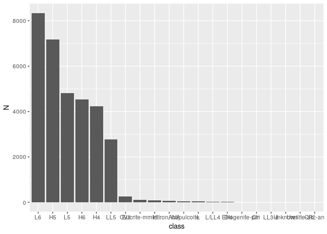<!-- -->

VERY unbalanced. It seems that most meteorites are concentrated in those
6 categories. There’s a long wikipedia article that I could read if I
decided to analyse them.

``` r
meteorites[name_type == "Valid", .N, by = class] %>% 
  .[order(-N)] %>% 
  .[1:6] %>% 
  .[, unique(class)] -> most_classes
```

I bet mass distribution is also very skewed.

``` r
meteorites %>% 
  ggplot(aes(mass)) +
  geom_histogram() +
  scale_x_log10()
```

    ## Warning: Transformation introduced infinite values in continuous x-axis

    ## `stat_bin()` using `bins = 30`. Pick better value with `binwidth`.

    ## Warning: Removed 150 rows containing non-finite values (stat_bin).

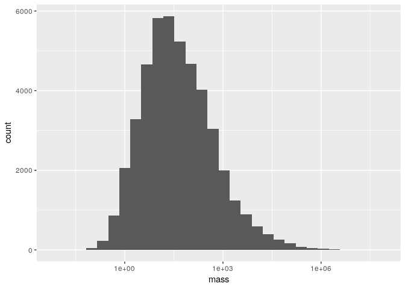<!-- -->

Yup. There are 131 missing values, also. Very few, so I’m not gonna
worry about it just now. Although, how many complete cases do we have?

``` r
mean(complete.cases(meteorites))
```

    ## [1] 0.8337344

83% is not bad, but also not excellent.

What’s the distribution with age?

``` r
ggplot(meteorites, aes(year)) +
  geom_histogram(binwidth = 1) +
  scale_x_continuous(limits = c(NA, 2019))
```

    ## Warning: Removed 292 rows containing non-finite values (stat_bin).

    ## Warning: Removed 1 rows containing missing values (geom_bar).

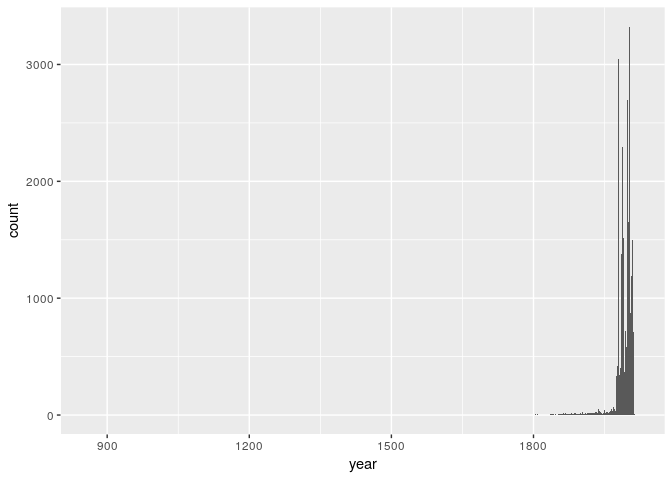<!-- -->

Not surprisingly, most of them are registered in moder times, but there
are also ancient records. But just a tiny amount:

``` r
nrow(meteorites[year < 1800])
```

    ## [1] 60

I also want to glance at the spatial distribution.

``` r
map <- geom_sf(data = rnaturalearth::ne_countries(returnclass = "sf"), 
               inherit.aes = FALSE)

ggplot(meteorites, aes(long, lat)) +
  map +
  geom_point() 
```

    ## Warning: Removed 7315 rows containing missing values (geom_point).

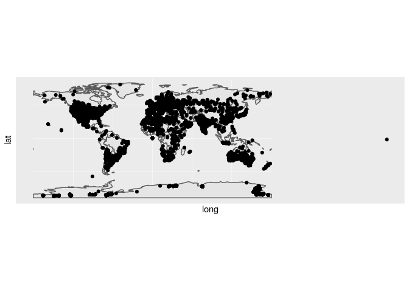<!-- -->

…. That one on the far right is nonsense.

``` r
meteorites[, long := metR::ConvertLongitude(long, from = 360)]


ggplot(meteorites, aes(long, lat)) +
  map + 
  geom_point()
```

    ## Warning: Removed 7315 rows containing missing values (geom_point).

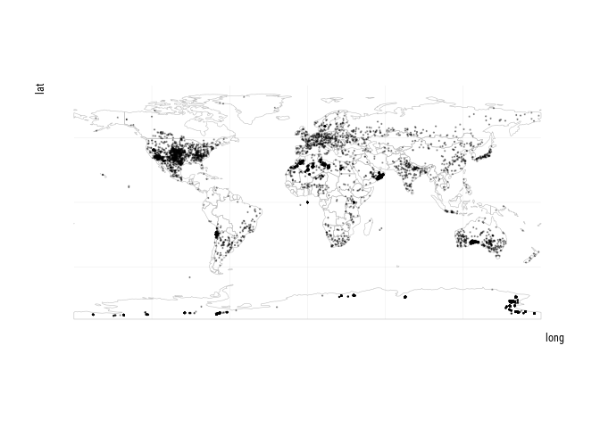<!-- -->

Much better. Althouth the distribution of falling meteorites is probably
uniform, there’s clearly a strong bias towards populated areas. I’ll
aggregate to eliminate overplotting

``` r
(g <- ggplot(meteorites, aes(long, lat)) +
   map + 
   geom_hex() )
```

    ## Warning: Removed 7315 rows containing non-finite values (stat_binhex).

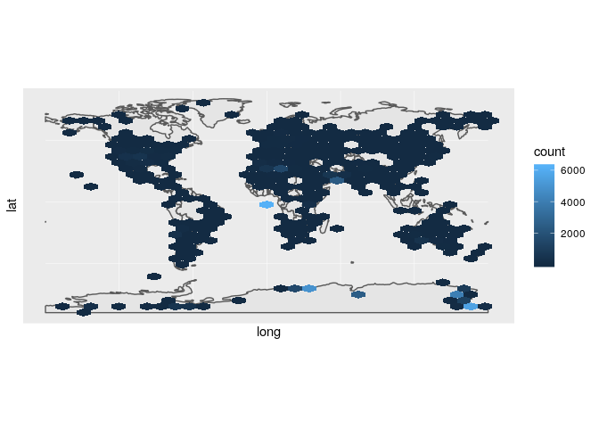<!-- -->

Wowzer\! Why are there so many of them found in ecuatorial Africa? I bet
that’s due to a concerned research effort and not accidental finds. If
we split according to found vs fell meteorites…

``` r
g +
  facet_wrap(~fall)
```

    ## Warning: Removed 7315 rows containing non-finite values (stat_binhex).

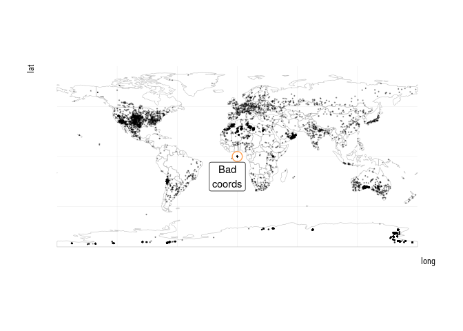<!-- -->

Yup. the scale is not working here. I’ll concentrate on the “fell”
meteorites. Bur first, what do those categories mean? According to [this
site](https://www.permanent.com/meteorites-falls-finds.html) “fell”
meteorites are the ones that have been seen falling from the skies,
while “found” meteorites are just found there on the
    ground.

``` r
g %+% meteorites[fall == "Fell"]
```

    ## Warning: Removed 10 rows containing non-finite values (stat_binhex).

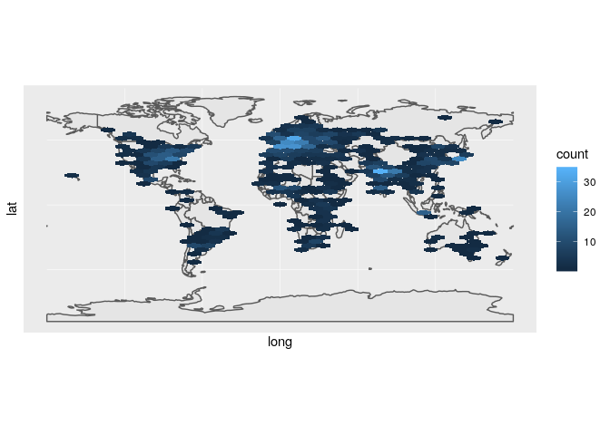<!-- -->

It’s proabbly a big coincidence to see a meteorite and then find it on
the ground so is not a surprise that those cases are concentrated in
areas with many people. However, what’s up with northern europe?

Ok. But that’s only the number of meteorites, how about the total mass
found in each place?

``` r
ggplot(meteorites[is.finite(mass)], aes(long, lat)) +
  map + 
  stat_summary_hex(aes(z = mass), fun = sum, bins = 50) +
  scale_fill_viridis_c(trans = scales::log10_trans())
```

    ## Warning: Removed 7303 rows containing non-finite values (stat_summary_hex).

    ## Warning: Transformation introduced infinite values in discrete y-axis

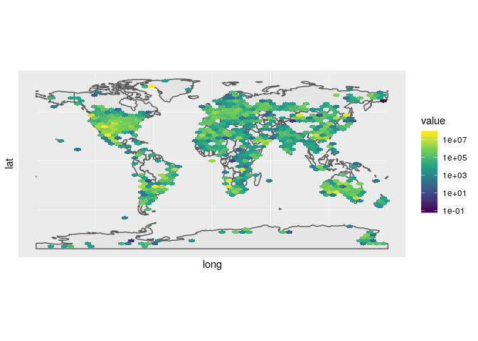<!-- -->

North America has a greater density of “meteorite mass”, apparently.
Although it’s improtant to note that here the equal size hexagons are
probably not equal in area. But in any case, is not hard to believe that
most finds would be located near the country in which most research is
done.

Ok, up untill now it’s been kind of still. Let’s see some movement.
First, has there been an overall tren in meteorite collection? Now, I’ve
cheated and realised that there are some problems with the dates.

``` r
range(meteorites$year, na.rm = TRUE)
```

    ## [1]  860 2101

Huh.. so there are meteorites found in the future? That can’t be right,
let’s try something else.

``` r
range(meteorites[year < 2050, year], na.rm = TRUE)
```

    ## [1]  860 2013

Now’s more like it. The latest corect year is 2013. I can use that to
filter out the bad ones. I will also concentrate on the modern(ish)
period.

``` r
(g <- meteorites %>% 
   .[year %between% c(1800, 2013)] %>% 
   .[, .N, by = .(year, fall)] %>% 
   ggplot(aes(year, N)) +
   geom_line() +
   scale_x_continuous(limits = c(NA, 2013), breaks = scales::pretty_breaks(10)) +
   facet_wrap(~fall, scales = "free_y", ncol = 1) +
   hrbrthemes::theme_ipsum_rc())
```

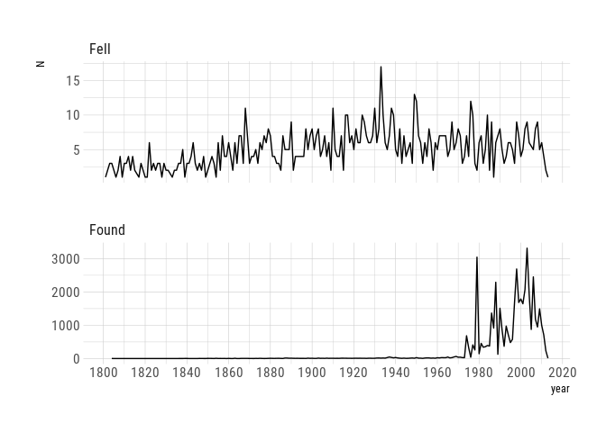<!-- -->

There are clear trends here. It looks like the anual number of “fell”
meteorites had been steadily incrasing from the 1800’s until it peaked
around the 1940’s. From that decade forward, it’s been on a sofmore
slump, or even slightlly decreasing. Why would that be? Maybe it has to
do with the reduction of dark skies that makes it more difficult to
actually see anything falling from the heavens.

The number of “found” meteorites has fluctuated widely. They only apper
after the 60’s, but they quickly overtake the “fell” ones by order of
magnitude. However, there is a hint of a reduction after the 2000s. I
want to take a closer look at the recent decades.

``` r
g +
  scale_x_continuous(limits = c(1980, 2013)) 
```

    ## Scale for 'x' is already present. Adding another scale for 'x', which
    ## will replace the existing scale.

    ## Warning: Removed 155 rows containing missing values (geom_path).

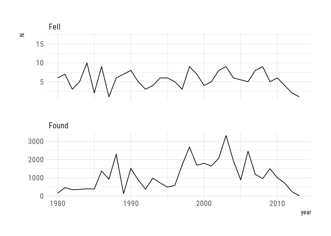<!-- -->

Yep, it certrainly looks like a reduction, but those low values after
2010 look fishy to me. Maybe they didn’t record them all before the data
was released. In any case, I’m also curious about the spatial
distribution of trends.

For that I will divide the globe in hexagons and aggregate the number of
finds for each one and each year, and finally compute linear trends. The
trends vary wildy, so I use a symmetric log transform on the colours.

``` r
hex_grid <- meteorites %>% 
  .[fall == "Found"] %>% 
  .[year %between% c(1980, 2010)] %>% 
  with(., hexbin(long, lat, xbins = 15, IDs = TRUE))
hex_grid_df <- as.data.table(hcell2xy(hex_grid)) %>% 
  .[, id := hex_grid@cell]

trends <- meteorites %>% 
  .[fall == "Found"] %>% 
  .[year %between% c(1980, 2010)] %>% 
  .[, id := hex_grid@cID] %>% 
  hex_grid_df[., on = "id"] %>% 


  .[, .N, by = .(fall, x, y, year)] %>% 
  # .[complete.cases(.)] %>% 
  .[, metR::FitLm(N, year), by = .(fall, x, y)] %>% 
  .[term == "year"] 

C <- 1/log(10)

trends %>% 
  # .[fall == "Found"] %>%
  .[complete.cases(.)] %>%
  ggplot(aes(x, y)) +
  map +
  geom_point(aes(color = sign(estimate) * log10(1 + abs(estimate/C))), size = 4) +
  metR::scale_color_divergent("Trends in meteorite finds\n 1980 to 2010 (symmetric log)",
                              oob = scales::squish) +
  metR:::theme_field() 
```

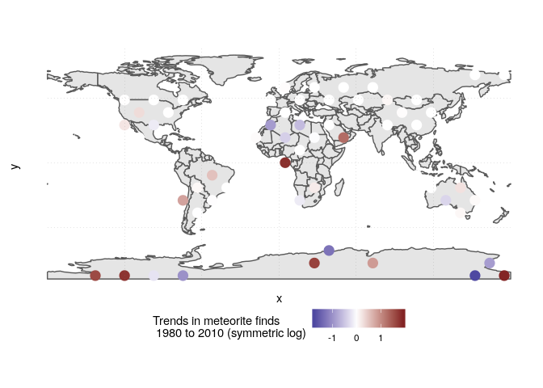<!-- -->
