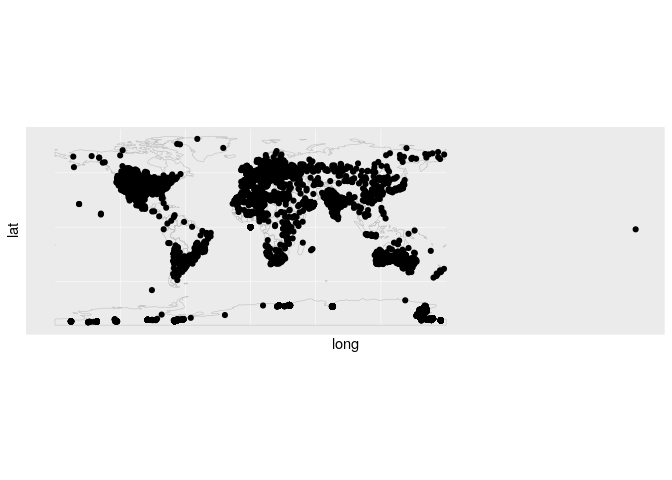
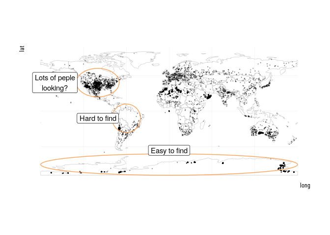
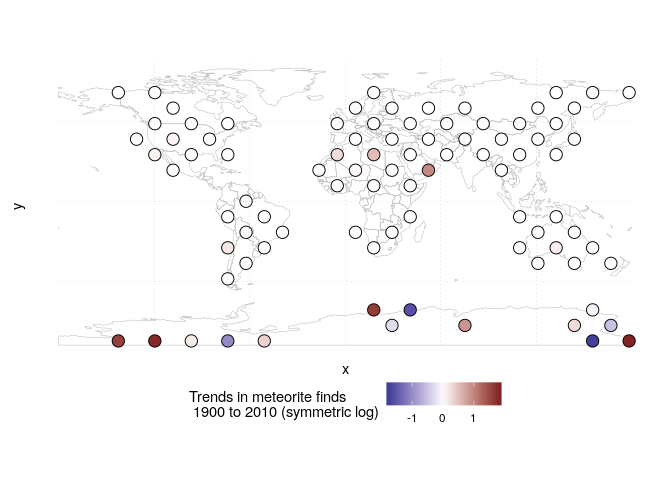

Memteorites
================
Elio Campitelli

First read the data:

``` r
library(data.table)
library(ggplot2)
```

    ## Registered S3 methods overwritten by 'ggplot2':
    ##   method         from 
    ##   [.quosures     rlang
    ##   c.quosures     rlang
    ##   print.quosures rlang

``` r
library(magrittr)
library(hrbrthemes)
```

    ## NOTE: Either Arial Narrow or Roboto Condensed fonts are required to use these themes.

    ##       Please use hrbrthemes::import_roboto_condensed() to install Roboto Condensed and

    ##       if Arial Narrow is not on your system, please see http://bit.ly/arialnarrow

``` r
meteorites <- fread("https://raw.githubusercontent.com/rfordatascience/tidytuesday/master/data/2019/2019-06-11/meteorites.csv")

name <- knitr::current_input(dir = TRUE)
name <- "/home/elio/Documents/ddm/03 - Meteorites/README.Rmd"
name <- strsplit(name, "/", fixed = TRUE)[[1]]
dir <- name[length(name) - 1]
dir <- stringi::stri_replace_all(dir, "%20", fixed = " ")

url <- paste0("https://github.com/eliocamp/ddm/tree/master/", dir)

library(spindler)
this_thread <- thread$new(tag = "tw")

this_thread$add_post("I'm a bit late for this week's #tidytuesday, but I wanted to give it a go anyway. Specially because I'm using it as an excuse to try the spindler package in the real world. So join me as we learn a (little) bit about meteorites! #rstats")$
  add_post("So this week's data consists of about 50000 records of meteorites found on Earth. They've got names, mass, a classification, and long/lat coordinates, all divided by year. ")


Compass <- function(x, y, a , b = a, n = 10) {
  tita <- seq(0, 2*pi, length.out = n + 1)
  x <- x + a*cos(tita)
  y <- y + b*sin(tita)
  data.frame(x = x, y = y )
}
```

``` r
str(meteorites)
```

    ## Classes 'data.table' and 'data.frame':   45716 obs. of  10 variables:
    ##  $ name       : chr  "Aachen" "Aarhus" "Abee" "Acapulco" ...
    ##  $ id         : int  1 2 6 10 370 379 390 392 398 417 ...
    ##  $ name_type  : chr  "Valid" "Valid" "Valid" "Valid" ...
    ##  $ class      : chr  "L5" "H6" "EH4" "Acapulcoite" ...
    ##  $ mass       : num  21 720 107000 1914 780 ...
    ##  $ fall       : chr  "Fell" "Fell" "Fell" "Fell" ...
    ##  $ year       : int  1880 1951 1952 1976 1902 1919 1949 1814 1930 1920 ...
    ##  $ lat        : num  50.8 56.2 54.2 16.9 -33.2 ...
    ##  $ long       : num  6.08 10.23 -113 -99.9 -64.95 ...
    ##  $ geolocation: chr  "(50.775, 6.08333)" "(56.18333, 10.23333)" "(54.21667, -113.0)" "(16.88333, -99.9)" ...
    ##  - attr(*, ".internal.selfref")=<externalptr>

Ok. We’ve got some interesting data. I love having coordinates. I don’t
know exactly what “geolocation” is. It seems to be some sort of
alternative coordinates. I wonder about the “class” column, though. How
many class are there?

``` r
uniqueN(meteorites$class)
```

    ## [1] 455

Woah\! That a lost of clases\! How many meteors of each? (only looking
at “valid” objects)

``` r
meteorites[name_type == "Valid", .N, by = class] %>% 
  .[, class := reorder(class, -N)] %>% 
  .[1:20] %>% 
  ggplot(aes(class, N)) +
  geom_col()
```

<!-- -->

VERY unbalanced. It seems that most meteorites are concentrated in those
6 categories. There’s a long wikipedia article that I could read if I
decided to analyse
them.

``` r
this_thread$add_post("There's a long-ass wikipedia article on the subject (https://en.m.wikipedia.org/wiki/Meteorite_classification ), but as someone with zero geology training it's all meaningless to me. Lesson one: data withouth appropiate domain expertise is pretty much useless.")
```

``` r
meteorites[name_type == "Valid", .N, by = class] %>% 
  .[order(-N)] %>% 
  .[1:6] %>% 
  .[, unique(class)] -> most_classes
```

I bet mass distribution is also very skewed.

``` r
meteorites %>% 
  ggplot(aes(mass)) +
  geom_histogram() +
  scale_x_log10()
```

    ## Warning: Transformation introduced infinite values in continuous x-axis

    ## `stat_bin()` using `bins = 30`. Pick better value with `binwidth`.

    ## Warning: Removed 150 rows containing non-finite values (stat_bin).

<!-- -->

Yup. There are 131 missing values, also. Very few, so I’m not gonna
worry about it just now. Although, how many complete cases do we have?

``` r
mean(complete.cases(meteorites))
```

    ## [1] 0.8337344

83% is not bad, but also not excellent.

What’s the distribution with age?

``` r
ggplot(meteorites, aes(year)) +
  geom_histogram(binwidth = 1) +
  scale_x_continuous(limits = c(NA, 2019))
```

    ## Warning: Removed 292 rows containing non-finite values (stat_bin).

    ## Warning: Removed 1 rows containing missing values (geom_bar).

<!-- -->

Not surprisingly, most of them are registered in moder times, but there
are also ancient records. But just a tiny amount:

``` r
nrow(meteorites[year < 1800])
```

    ## [1] 60

I also want to glance at the spatial distribution.

``` r
map <- geom_sf(data = rnaturalearth::ne_countries(returnclass = "sf"), 
               inherit.aes = FALSE, fill = NA, color = "gray", size = 0.2)

ggplot(meteorites, aes(long, lat)) +
  map +
  geom_point() 
```

    ## Warning: Removed 7315 rows containing missing values (geom_point).

<!-- -->

…. That one on the far right is nonsense.

``` r
meteorites[, long := metR::ConvertLongitude(long, from = 360)]


(g <- ggplot(meteorites, aes(long, lat)) +
  map + 
  geom_point(alpha = 0.3, size = 0.2) +
    theme_ipsum_rc())
```

    ## Warning: Removed 7315 rows containing missing values (geom_point).

<!-- -->

``` r
library(ggforce)
g +  
  geom_path(data = Compass(0, -75, 180, 15, n = 100), aes(x, y), color = "#ffa154") + 
  annotate("label", x = 0, y = -55, label = "Easy to find") +
  geom_path(data = Compass(-60, -10, 20, 20, n = 100), aes(x, y), color = "#ffa154") +
  annotate("label", x = -100, y = -10, label = "Hard to find") +
  geom_path(data = Compass(-100, 40, 30, 20, n = 100), aes(x, y), color = "#ffa154") +
  annotate("label", x = -160, y = 40, label = "Lots of peple\nlooking?") 
```

    ## Warning: Removed 7315 rows containing missing values (geom_point).

<!-- -->

``` r
g + geom_path(data = Compass(0, 0, 5, 5, n = 100), aes(x, y), color = "#ffa154") +
  annotate("label", x = -10, y = -20, label = "Bad\ncoords") 
```

    ## Warning: Removed 7315 rows containing missing values (geom_point).

<!-- -->

``` r
meteorites <- meteorites[lat != 0 & long != 0]
```

Much better. Althouth the distribution of falling meteorites is probably
uniform, there’s clearly a strong bias towards populated areas.

Ok, up untill now it’s been kind of still. Let’s see some movement.
First, has there been an overall tren in meteorite collection?

``` r
(g <- meteorites %>% 
   .[year %between% c(1800, 2013)] %>% 
   .[, .N, by = .(year, fall)] %>% 
   ggplot(aes(year, N)) +
   geom_line() +
   scale_x_continuous(limits = c(NA, 2013), breaks = scales::pretty_breaks(10)) +
   scale_y_log10("N (log)") +
   facet_wrap(~fall, scales = "free_y", ncol = 1) +
   hrbrthemes::theme_ipsum_rc())
```

<!-- -->

There are clear trends here. It looks like the anual number of “fell”
meteorites had been steadily incrasing from the 1800’s until it peaked
around the 1940’s. From that decade forward, it’s been on a sofmore
slump, or even slightlly decreasing. Why would that be? Maybe it has to
do with the reduction of dark skies that makes it more difficult to
actually see anything falling from the
heavens.

``` r
this_thread$add_post("What do these categories mean, though? A little google lead me to this.", media = "falls_finds.png")
```

``` r
meteorites %>% 
  .[fall == "Fell"] %>% 
   .[year %between% c(1800, 2013)] %>% 
   .[, .N, by = .(year, fall)] %>% 
   ggplot(aes(year, N)) +
   geom_line() +
   scale_x_continuous(limits = c(NA, 2013), breaks = scales::pretty_breaks(10)) +
   facet_wrap(~fall, scales = "free_y", ncol = 1) +
   hrbrthemes::theme_ipsum_rc() 
```

<!-- -->

Yup. the scale is not working here. I’ll concentrate on the “fell”
meteorites. Bur first, what do those categories mean? According to [this
site](https://www.permanent.com/meteorites-falls-finds.html) “fell”
meteorites are the ones that have been seen falling from the skies,
while “found” meteorites are just found there on the
ground.

``` r
this_thread$add_post("Now I'm curious about the spacial distribution of these trends. It's a nice challenge. I need to count yearly finds that are near each other to get a representative time series to which to compute a trend.")$
  add_post('The "easy" way would be to lay out a regular grid, but I\'m thinking I want a better option: Hexagon grid. ')
```

Yep, it certrainly looks like a reduction, but those low values after
2010 look fishy to me. Maybe they didn’t record them all before the data
was released. In any case, I’m also curious about the spatial
distribution of trends.

For that I will divide the globe in hexagons and aggregate the number of
finds for each one and each year, and finally compute linear trends. The
trends vary wildy, so I use a symmetric log transform on the colours.

``` r
library(hexbin)
hex_grid <- meteorites %>% 
  .[fall == "Found"] %>% 
  .[year %between% c(1900, 2010)] %>% 
  with(., hexbin(long, lat, xbins = 15, IDs = TRUE))
hex_grid_df <- as.data.table(hcell2xy(hex_grid)) %>% 
  .[, id := hex_grid@cell]

trends <- meteorites %>% 
  .[fall == "Found"] %>% 
  .[year %between% c(1900, 2010)] %>% 
  .[, id := hex_grid@cID] %>% 
  hex_grid_df[., on = "id"] %>% 
  
  
  .[, .N, by = .(fall, x, y, year)] %>% 
  # .[complete.cases(.)] %>% 
  .[, metR::FitLm(N, year), by = .(fall, x, y)] %>% 
  .[term == "year"] 

C <- 1/log(10)

(g <- trends %>% 
  .[fall == "Found"] %>%
  .[complete.cases(.)] %>%
  # .[y > -60] %>%
  ggplot(aes(x, y)) +
  map +
  geom_point(aes(fill = sign(estimate) * log10(1 + abs(estimate/C))), 
             size = 4, shape = 21) +
  metR::scale_fill_divergent("Trends in meteorite finds\n 1900 to 2010 (symmetric log)",
                              oob = scales::squish) +
  metR:::theme_field() )
```

<!-- -->

``` r
g
```

<!-- -->

``` r
this_thread$add_post("Interestingly, it seems that there has ben an increse in north african dealers that sell meteorites to researchers!   http://news.bbc.co.uk/2/hi/africa/6549197.stm")$
  add_post("So this #tidytuesday data provided some in where meteorites are found, opened up the posibility that losing dark skies means less meteorite findings and gave a glimpse into geographic trends.")$
  add_post(paste0("Thread created with the spindler package: https://git.io/fjzxN \n",
                  "It's source code can be found at ", url, "\n",
                  "#rstats #tidytuesday"))
```

``` r
this_thread$publish()
```

    ## your tweet has been posted!
    ## your tweet has been posted!
    ## your tweet has been posted!
    ## your tweet has been posted!
    ## your tweet has been posted!
    ## your tweet has been posted!
    ## your tweet has been posted!
    ## your tweet has been posted!
    ## your tweet has been posted!
    ## your tweet has been posted!
    ## your tweet has been posted!
    ## your tweet has been posted!
    ## your tweet has been posted!
    ## your tweet has been posted!
    ## your tweet has been posted!
    ## your tweet has been posted!
    ## your tweet has been posted!
    ## your tweet has been posted!

``` r
saveRDS(this_thread, "~/thread.Rds")
```
