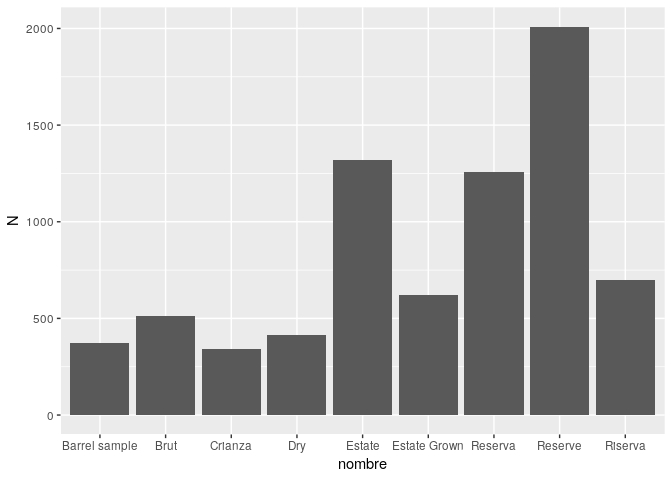
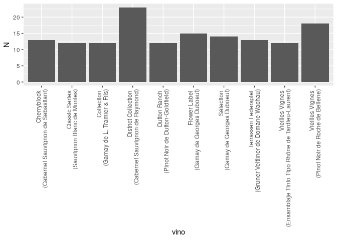
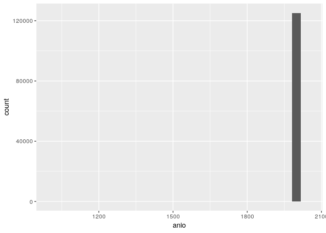
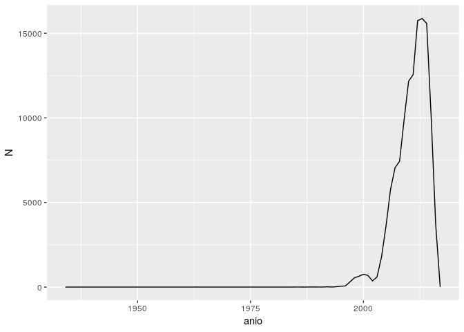
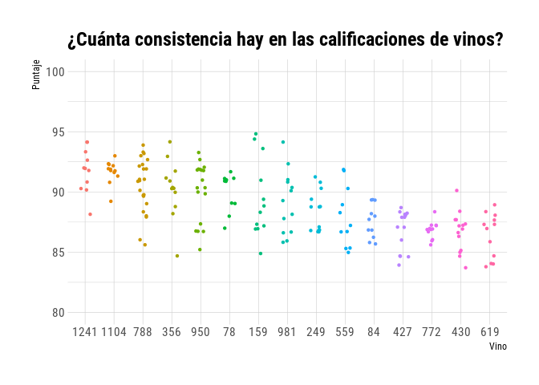
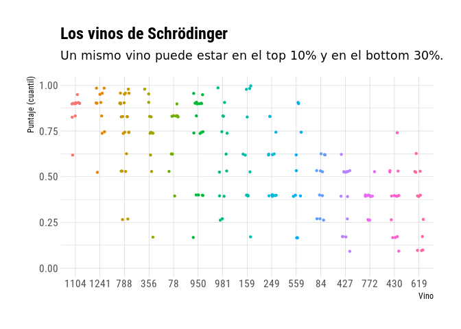

Vinos
================
Elio Campitelli

Como siempre, primero leo los datos.

``` r
library(data.table)
library(ggplot2)
```

    ## Registered S3 methods overwritten by 'ggplot2':
    ##   method         from 
    ##   [.quosures     rlang
    ##   c.quosures     rlang
    ##   print.quosures rlang

``` r
library(magrittr)
library(hrbrthemes)

vinos <- fread("https://raw.githubusercontent.com/cienciadedatos/datos-de-miercoles/master/datos/2019/2019-06-12/vinos.csv")

name <- knitr::current_input(dir = TRUE)
name <- strsplit(name, "/", fixed = TRUE)[[1]]
dir <- name[length(name) - 1]
dir <- stringi::stri_replace_all(dir, "%20", fixed = " ")

url <- paste0("https://github.com/eliocamp/ddm/tree/master/", dir)

library(spindler)
this_thread <- thread$new(tag = "tw")$
  add_post(paste0("Hola, #DatosDeMiércoles. Esta semana vamos a brindarcon datos de reviews de vinos! ", emo::ji("wine"), "\n",
                  "A penas vi los datos lo primero que quise hacer fue evaluar la consistencia de los puntajes de vino. Veamos si puedo! \n #rstats #rstatsES"))
```

Apenas leí que este Datos de Miércoles era sobre vinos, lo primero que
quise evaluar es la consistencia en el puntaje de un mismo vino. Viendo
los datos, resulta que no es tan fácil. Pero vamos a ver si puedo hacer
algo. ¿Qué identifica a cada vino? Supongo que el nombre. Pero quizás
hay más de una marca que le puso el mismo nombre? Hay que ver.

``` r
vinos[, .N, by = nombre][order(-N)][1:10] %>% 
  .[complete.cases(.)] %>% 
  ggplot(aes(nombre, N)) +
  geom_col()
```

<!-- -->

Muchos NAs, ok. Pero también muchísimos con nombre “Reserve” o
“Riserva”, etc… Es seguro que estos no son los mismos vinos. Pero
tenemos también la variedad y el viñedo,

``` r
vinos[, .N, by = .(nombre, vina, variedad)][order(-N)] %>% 
  .[complete.cases(.)] %>% 
  .[1:10] %>%
  .[, vino := paste0(nombre, " \n(", variedad, " de ", vina, ")")] %>% 
  ggplot(aes(vino, N)) +
    geom_col() +
  theme(axis.text.x = element_text(angle = 90, hjust = 1, vjust = 0.5))
```

<!-- -->

Ok, eso podría ser mejor. Veamos por ejemplo los datos de uno en
particular

``` r
this_thread$add_post(paste0("Los nombres de las reseñas tienen el año en que se hizo y en la versión larga (que pueden encontrar acá: ", url, ") armé una función que usa expresiones regulares para extraerla, pero al final no lo usé", emo::ji("shrug")))
```

``` r
vinos[nombre == "Sélection" & vina == "Georges Duboeuf" & variedad == "Gamay"] %>% 
  .[, .(nombre, vina, variedad, titulo_resena)] %>% 
  .[1:5] %>% 
  knitr::kable()
```

| nombre    | vina            | variedad | titulo\_resena                                       |
| :-------- | :-------------- | :------- | :--------------------------------------------------- |
| Sélection | Georges Duboeuf | Gamay    | Georges Duboeuf 2009 Sélection (Moulin-à-Vent)       |
| Sélection | Georges Duboeuf | Gamay    | Georges Duboeuf 2009 Sélection (Juliénas)            |
| Sélection | Georges Duboeuf | Gamay    | Georges Duboeuf 2009 Sélection (Brouilly)            |
| Sélection | Georges Duboeuf | Gamay    | Georges Duboeuf 2011 Sélection (Juliénas)            |
| Sélection | Georges Duboeuf | Gamay    | Georges Duboeuf 2011 Sélection (Beaujolais-Villages) |

Ok\! Tenemos múltiples reviews de un mismo vino en distintos años. Esto
se pone bueno\! Voy a manipular las cosas para separar el año de la
reseña. Vamos a usar expresiones regulares para capturar todo lo que
sean cuatro dígitos. Chequeo un par para ver que haya salido bien:

``` r
library(stringi)
vinos[, anio := as.numeric(stri_extract(titulo_resena, regex = "\\d{4}"))]
set.seed(42)
vinos[sample(1:.N, 15), .(anio, titulo_resena)] %>% 
  knitr::kable()
```

| anio | titulo\_resena                                                                        |
| ---: | :------------------------------------------------------------------------------------ |
| 2010 | Monte Volpe 2010 Peppolino Red (Mendocino County)                                     |
| 2012 | Edetària 2012 Selecció Garnacha Blanca (Terra Alta)                                   |
| 2009 | Herdade do Esporão 2009 S Syrah (Alentejano)                                          |
| 2007 | Colutta 2007 Pinot Grigio (Colli Orientali del Friuli)                                |
| 2006 | Lazy River 2006 Private Lumpkin Riesling                                              |
| 2010 | Viña Alicia 2010 Coleccion de Familia Brote Negro Malbec (Luján de Cuyo)              |
| 2014 | Frédéric Mallo 2014 Réserve Spéciale Riesling (Alsace)                                |
| 2011 | Vinos de Arganza 2011 Flavium Selección Mencía (Bierzo)                               |
| 2009 | Elvio Cogno 2009 Vigna Elena Riserva (Barolo)                                         |
| 2014 | Château Léognan 2014 Pessac-Léognan                                                   |
| 2008 | Substance 2008 Cf Cabernet Franc (Washington)                                         |
| 2010 | Château Saintongey 2010 Vieilles VIgnes (Bordeaux)                                    |
| 2007 | Chiarito 2007 Estate Bottled Nero d’Avola (Mendocino)                                 |
| 2009 | Chateau Ste. Michelle 2009 Horse Heaven Vineyard Sauvignon Blanc (Horse Heaven Hills) |
| 2010 | Terre Rouge 2010 Sentinel Oak Vineyard-Pyramid Block Syrah (Shenandoah Valley (CA))   |

Vemos el rango…

``` r
range(vinos$anio, na.rm = TRUE)
```

    ## [1] 1000 7200

Ups. Además de que hay NAs (algunos que no encontró un año) hay algunos
que están mal. Posiblemente el nombre del vino tenga 4 dígitos o algo
así. Hay que sanitizar un poco.

``` r
# Ningún año puede ser mayor a 2019
vinos[anio > 2019, anio := NA]
```

A ver…

``` r
ggplot(vinos, aes(anio)) +
  geom_histogram()
```

    ## `stat_bin()` using `bins = 30`. Pick better value with `binwidth`.

    ## Warning: Removed 4624 rows containing non-finite values (stat_bin).

<!-- -->

Hay mcuhos con “año” muy bajo a ver qué
pasa:

``` r
vinos[order(anio)][1:10][, .(nombre, vina, variedad, titulo_resena)] %>% 
  knitr::kable()
```

| nombre                          | vina               | variedad           | titulo\_resena                                                           |
| :------------------------------ | :----------------- | :----------------- | :----------------------------------------------------------------------- |
| Bourbon Barrel Aged             | 1000 Stories       | Zinfandel          | 1000 Stories 2013 Bourbon Barrel Aged Zinfandel (Mendocino)              |
| Bourbon Barrel Aged Batch No 13 | 1000 Stories       | Zinfandel          | 1000 Stories 2014 Bourbon Barrel Aged Batch No 13 Zinfandel (California) |
| NA                              | 1070 Green         | Sauvignon Blanc    | 1070 Green 2011 Sauvignon Blanc (Rutherford)                             |
| NA                              | Ikal 1150          | Malbec             | Ikal 1150 2007 Malbec (Tupungato)                                        |
| NA                              | Ikal 1150          | Chardonnay         | Ikal 1150 2007 Chardonnay (Tupungato)                                    |
| 1492                            | Don Cristobal 1492 | Ensamblaje Tinto   | Don Cristobal 1492 2010 1492 Red (Mendoza)                               |
| Finca La Niña                   | Don Cristobal 1492 | Malbec             | Don Cristobal 1492 2010 Finca La Niña Malbec (Mendoza)                   |
| Finca La Niña                   | Don Cristobal 1492 | Cabernet Sauvignon | Don Cristobal 1492 2010 Finca La Niña Cabernet Sauvignon (Mendoza)       |
| Finca La Niña                   | Don Cristobal 1492 | Malbec             | Don Cristobal 1492 2010 Finca La Niña Malbec (Mendoza)                   |
| 1492 White                      | Cristobal 1492     | Ensamblaje Blanco  | Cristobal 1492 2009 1492 White White (Mendoza)                           |

Ahí va. Tienen un número enel nombre o la vina. Esto es un problema…
podría simplemente borrarlos, total hay muchos que son válidos, pero me
gustaría tratar algo. Voy a hacer una función que detecte todas las 4
cifras posibles en el título de la reseña, las compare con los números
que están en el nombre o la viña y elimine las que son iguales. Si queda
una sola, asumo que es el año, si no hay nada o hay más de una, no puedo
saber nada y le dejo NA.

``` r
resenia_a_anio <- function(titulo, nombre, vina) {
  anio_titulo <- stri_extract_all(titulo, regex = "\\d{4}")
  anio_nombre <- stri_extract_all(nombre, regex = "\\d{4}")
  anio_vina <- stri_extract_all(vina, regex = "\\d{4}")
  
  anio <- vapply(seq_along(anio_titulo), function(i) {
    repetido <- anio_titulo[[i]] %in% c(anio_nombre[[i]], anio_vina[[i]])
    anio_posible <-  anio_titulo[[i]][!repetido]
    
    if (length(anio_posible) != 1) {
      anio_posible <- NA
    }
    
    return(as.numeric(anio_posible))
    
  }, 1)
  return(anio)
}

vinos[, anio := resenia_a_anio(titulo_resena, nombre, vina)]

range(vinos$anio, na.rm = TRUE)
```

    ## [1] 1934 2017

Muucho mejor\! ¿Cuántas reseñas por año?

``` r
vinos[, .N, by = anio] %>% 
  ggplot(aes(anio, N)) +
  geom_line()
```

    ## Warning: Removed 1 rows containing missing values (geom_path).

<!-- -->

Esperable, la enorme mayoría son de los últimos 20 años. Bien, ahora se
viene lo bueno. Veamos el puntaje de cada vino. Primero, necesito vinos
con muchas reviews repetidas, ¿cómo estamos con eso?

``` r
vinos %>% 
  .[, .(anio, puntos, nombre, variedad, vina)] %>% 
  .[complete.cases(.)] %>% 
  .[, .N, by = .(nombre, variedad, vina)] %>% 
  .[order(-N)] %>% 
  .[1:15] %>% 
  knitr::kable()
```

| nombre               | variedad                    | vina               |  N |
| :------------------- | :-------------------------- | :----------------- | -: |
| District Collection  | Cabernet Sauvignon          | Raymond            | 23 |
| Vieilles Vignes      | Pinot Noir                  | Roche de Bellene   | 18 |
| Flower Label         | Gamay                       | Georges Duboeuf    | 15 |
| Sélection            | Gamay                       | Georges Duboeuf    | 14 |
| Terrassen Federspiel | Grüner Veltliner            | Domäne Wachau      | 13 |
| Cherryblock          | Cabernet Sauvignon          | Sebastiani         | 13 |
| Dutton Ranch         | Pinot Noir                  | Dutton-Goldfield   | 12 |
| Collection           | Gamay                       | L. Tramier & Fils  | 12 |
| Vieilles Vignes      | Ensamblaje Tinto Tipo Rhône | Tardieu-Laurent    | 12 |
| Classic Series       | Sauvignon Blanc             | Montes             | 12 |
| Domaine des Perdrix  | Pinot Noir                  | Domaines Devillard | 12 |
| Les Clans            | Rosé                        | Château d’Esclans  | 11 |
| Whispering Angel     | Rosé                        | Château d’Esclans  | 11 |
| Niclaire             | Pinot Noir                  | Testarossa         | 11 |
| Vintner’s Reserve    | Pinot Noir                  | Kendall-Jackson    | 11 |

🤨. Uff… no son demasiadas. Pero bueno, es lo que hay.

``` r
seleccion <- vinos %>% 
  .[, .(anio, puntos, cuantil = ecdf(puntos)(puntos), nombre, variedad, vina)] %>% 
  .[complete.cases(.)] %>% 
  .[, N := .N, by = .(nombre, variedad, vina)] %>% 
  .[N > 10] %>% 
  .[, vino := as.numeric(interaction(nombre, variedad, vina))]
  
copy(seleccion) %>% 
  .[, puntos_medio := mean(puntos), by = vino] %>% 
  .[, vino := reorder(vino, -puntos_medio)] %>% 
  ggplot(aes(vino, puntos)) + 
  geom_jitter(width = 0.2, size = 0.9, aes(color = vino)) +
  scale_y_continuous("Puntaje", limits = c(80, 100)) +
  scale_color_discrete(guide = "none") +
  scale_x_discrete("Vino") +
  hrbrthemes::theme_ipsum_rc() +
  labs(title = "¿Cuánta consistencia hay en las calificaciones de vinos?")
```

<!-- -->

Le puse un número medio aleatorio a cada vino porque no me interesa el
nombre o el tipo de vino (tampoco sé de vinos, así que no me sería de
ayuda). Se ve que hay un spread interesante en cada vino. El rango
gráfico muestra todo el rango usado por todos los vinos (de 80 a 100),
y se ve que los puntajes de algunos vinos cubren casi la mitad de ese
rango\!

El efecto se puede apreciar convirtiendo los puntajes en cuantiles. La
variabilidad es muy grande, haciendo que un vino pueda estar en el top
10% o en el bottom 30%.

``` r
copy(seleccion) %>% 
  .[, puntos_medio := mean(cuantil), by = vino] %>% 
  .[, vino := reorder(vino, -puntos_medio)] %>% 
  ggplot(aes(vino, cuantil)) + 
  geom_jitter(width = 0.2, size = 0.9, aes(color = vino)) +
  scale_y_continuous("Puntaje (cuantil)", limits = c(0, 1)) +
  scale_color_discrete(guide = "none") +
  scale_x_discrete("Vino") +
  hrbrthemes::theme_ipsum_rc() +
  labs(title = "Los vinos de Schrödinger",
       subtitle = "Un mismo vino puede estar en el top 10% y en el bottom 30%.")
```

<!-- -->

``` r
this_thread$add_post(paste0("Con estos #DatosDeMiércoles entonces aprendímos que, al menos para los vinos maś o menos buenos, los puntajes son muy poco importantes.\n El código fuente de este hilolo pueden ver encontrar en ", url))$
  add_post("PD: Hice este thread directamente desde knitr con el paquete spindler: https://git.io/fjzxN \n #rstats #rstatsES")
```

Al final no usé los años que tanto me costó conseguir (?), pero bueno.

``` r
this_thread$publish()
```

    ## your tweet has been posted!
    ## your tweet has been posted!
    ## your tweet has been posted!
    ## your tweet has been posted!
    ## your tweet has been posted!
    ## your tweet has been posted!
    ## your tweet has been posted!
    ## your tweet has been posted!

``` r
saveRDS(this_thread, "~/thread.Rds")
```
