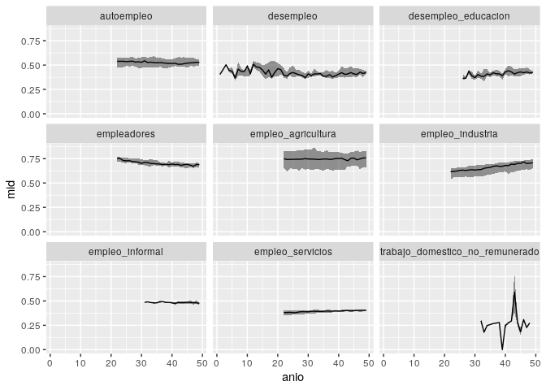

Empleo Femenino
================
Elio Campitelli

Primero leemos los datos

``` r
library(data.table)
library(magrittr)
library(ggplot2)

empleo_genero <- fread("https://raw.githubusercontent.com/cienciadedatos/datos-de-miercoles/master/datos/2019/2019-10-16/empleo_genero.csv", header = TRUE)
```

Voy a “rotar” la tabla primero.

``` r
ratios <- empleo_genero %>% 
  .[variable != "legislacion_acoso_sexual"] %>% 
  .[variable %like% "hombres", genero := "h"] %>% 
  .[variable %like% "mujeres", genero := "m"] %>% 
  .[, variable := gsub("_mujeres", "", variable)] %>% 
  .[, variable := gsub("_hombres", "", variable)] %>% 
  .[variable == "empleadoras", variable := "empleadores"] %>% 
  melt(id.vars = c("genero", "variable", "pais_region", "codigo_pais_region"), 
       variable.name = "anio") 
```

``` r
ratios %>% 
  dcast(anio + variable + pais_region + codigo_pais_region ~ genero) %>% 
  .[, ratio := h/(m+h)] %>% 
  .[, anio := as.numeric(anio)] %>% 
  na.omit() %>%
  .[, as.list(quantile(ratio, probs = c(0.25, 0.5, 1 - 0.25))) %>% 
      setNames(c("low", "mid", "upp")), by = .(variable, anio)] %>% 
  ggplot(aes(anio, mid)) +
  geom_ribbon(aes(ymin = low, ymax = upp), alpha = 0.5) +
  geom_line() +
  facet_wrap(~variable)
```

<!-- -->
